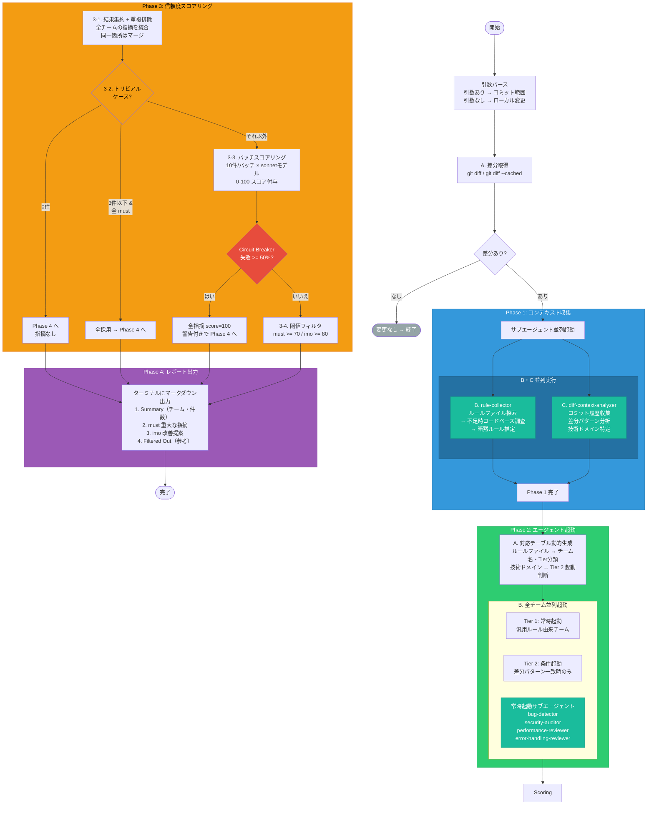

ARGUMENTS: $ARGUMENTS

引数がある場合、コミット範囲として解釈する。
- 例: `develop..HEAD` → `base=develop`, `head=HEAD`
- 引数なし → ローカル変更（ステージ済み + 未ステージ）をレビュー対象とする

---

# Phase 1: コンテキスト収集

## A. 変更差分の取得（メインが実行）

**引数なし:**
```bash
git diff
git diff --cached
```
両方の結果を結合する。どちらも空の場合は「レビュー対象の変更がありません」と報告して終了。

**引数あり:**
```bash
git diff <base>...<head>
```

取得した差分を `{diff}` として以降のフェーズで使用する。

## B. ルール収集（サブエージェント: rule-collector）

`agents/rule-collector.md` を Read で読み込み、その内容を Agent ツールの `prompt` として起動する。

**出力**: `{rule_files}`（発見されたルールファイル一覧 + 要約）、`{implicit_rules}`（暗黙ルール、該当する場合）

## C. コミット履歴・差分分析（サブエージェント: diff-context-analyzer）

`agents/diff-context-analyzer.md` を Read で読み込み、その内容に以下を追加して Agent ツールの `prompt` として起動する:

```
## Inputs
- args: {args}

## Diff
{diff}
```

**出力**: `{commit_context}`（コミット履歴）、`{detected_domains}`（技術分野一覧）

## B・C の起動方法

B と C は **1メッセージで並列起動** する（Agent ツール使用）。両方の完了を待ってから Phase 2 に進む。

## Phase 1 完了時の成果物

| 変数 | 供給元 | 用途 |
|------|--------|------|
| `{diff}` | メイン（A） | Phase 2・3 で全チームに配布 |
| `{rule_files}` | rule-collector（B） | Phase 2A のテーブル動的生成 |
| `{implicit_rules}` | rule-collector（B） | Phase 2A の補助情報 |
| `{commit_context}` | diff-context-analyzer（C） | Phase 3 のスコアリング文脈 |
| `{detected_domains}` | diff-context-analyzer（C） | Phase 2A の Tier 2 起動判断 |

---

# Phase 2: エージェント起動

## A. ルール → エージェント対応テーブルの動的生成

Phase 1B の `{rule_files}` から動的にチームマッピングテーブルを構築する。

### 手順

1. 各ルールファイルの内容を Read で読み込む
2. ファイル名と内容からチーム名・レビュー観点を抽出する
3. Tier 分類を決定する:
   - **Tier 1（常時起動）**: 汎用的・基本的なルール（アーキテクチャ、可読性、テスト、型構造等）
   - **Tier 2（条件起動）**: 特定技術・フレームワーク固有のルール。Phase 1C の `{detected_domains}` に一致する場合のみ起動
4. 各 Tier 2 チームの起動条件（ファイルパスパターン、キーワード）をルール内容から推定する
5. 以下の形式でテーブルを整理する:

```
| チーム名 | ルールファイル | Tier | 起動条件 |
|---------|-------------|------|---------|
| {name} | {path} | 1 | 常時 |
| {name} | {path} | 2 | {パターンの説明} |
```

### 常時起動チーム（ドキュメント非依存）

以下の4チームは `{rule_files}` に依存せず **常に起動** する。エージェント定義は `agents/` ディレクトリにある。

| チーム名 | エージェント定義 | 目的 |
|---------|---------------|------|
| bug-detector | `agents/bug-detector.md` | ロジックエラー、null安全性、リソース管理、非同期問題 |
| security-auditor | `agents/security-auditor.md` | OWASP Top 10 ベースのセキュリティ検査 |
| performance-reviewer | `agents/performance-reviewer.md` | パフォーマンスアンチパターン |
| error-handling-reviewer | `agents/error-handling-reviewer.md` | エラーハンドリングの品質 |

## B. エージェント並列起動

全チームを **1メッセージで並列起動** する（Agent ツール使用）。

### ルールファイルベースチームの共有プロンプトテンプレート

`{team_name}`, `{rule_file_path}`, `{input}` を動的に埋める:

```
あなたは {team_name} のレビュー担当者です。

## タスク
差分を `{rule_file_path}` のルールと照合し、違反を報告してください。

## 手順
1. Read ツールで `{rule_file_path}` を読み込む
2. 以下の差分を検査する:
   {input}
3. ルール違反をテーブル形式で報告する

## 出力フォーマット
| ファイル | 行 | 重大度 | ルール参照 | 指摘内容 |
|---------|---|--------|----------|---------|

重大度: [must] = クラッシュ/データ破損/セキュリティリスク, [imo] = 改善提案
指摘なしの場合は「指摘なし」とだけ出力する。

## 制約
- `{rule_file_path}` のルールのみを検査すること。他の観点は別チームが担当する
- ポジティブフィードバックや些末な指摘は不要
- 日本語で報告する
```

Tier 2 チームには差分全体ではなく **関連部分のみ** を `{input}` として渡す。

### サブエージェントチーム（常時起動）

各エージェント定義ファイルを Read で読み込み、その内容をプロンプトとして Agent ツールに渡す。
差分 `{diff}` は `## Diff` セクションとしてプロンプト末尾に追加する。

**起動手順（各チーム共通）:**
1. `agents/{team_name}.md` を Read で読み込む
2. 読み込んだ内容に以下を追加:
   ```
   ## Diff
   {diff}
   ```
3. 結合したテキスト全体を Agent ツールの `prompt` として起動する

---

# Phase 3: 信頼度スコアリング（False Positive Filter）

## 3-1. 結果集約 + 重複排除

全チームの指摘を統合リストに集約する。各指摘について記録:
- `id`（連番）
- `ファイル`（ファイルパス）
- `行`（行番号）
- `重大度`（`[must]` or `[imo]`）
- `チーム`（報告チーム）
- `指摘内容`（指摘の説明）
- `ルール参照`（該当する場合）

**重複排除**: 複数チームが同一ファイル・同一行を指摘した場合:
- 1つの指摘にマージ
- `[must]` が `[imo]` に優先
- `team`: 全チーム名を結合（例: `bug-detector, error-handling-reviewer`）
- `finding`: 各チームのユニークな内容を統合

## 3-2. トリビアルケーススキップ

| 条件 | アクション |
|------|----------|
| 指摘 0 件 | スコアリングスキップ → Phase 4 へ |
| 3 件以下 & 全 `[must]` | 全採用 → Phase 4 へ |

上記に該当しない場合、3-3 へ進む。

## 3-3. バッチスコアリング

指摘を 10 件/バッチにグループ化し、Agent（model: sonnet）で並列スコアリングする。
50 件超の場合: `[must]` を優先してスコアリング。残りは score=100 扱い。

**スコアリングエージェントプロンプト:**

```
あなたはコードレビューの偽陽性フィルターです。

## コンテキスト
- コミットメッセージ: {commit_context}

## タスク
以下の各指摘について、実際の問題である（偽陽性ではない）確信度を 0-100 のスコアで評価してください。

## スコアリング基準
- 0: 偽陽性。精査に耐えない、または既存の問題
- 25: 実際の問題かもしれないが確認できない。スタイル上の問題であればプロジェクトルールに記載なし
- 50: 実際の問題だが軽微。変更内容に対して重要度が低い
- 75: 高確率で実際の問題。プロジェクトルールまたは明確なコード証拠で検証済み。機能に影響する
- 100: 確実に実際の問題。ルールファイルを読んで確認した明示的なプロジェクトルール違反、または否定できないコード証拠

## 偽陽性の例（除外すべきもの）
- この差分の変更と無関係な既存の問題
- バグに見えるが正しい動作
- シニアエンジニアが指摘しないような些末な点
- リンター/コンパイラ/型チェッカーが検出する問題（CI が処理する）
- プロジェクトルールで要求されていない一般的な品質指摘

## ルール検証
`rule_reference` がある指摘について、実際のプロジェクトルールと照合する:
1. Read ツールでルールファイルを読み込む
2. 引用されたルールが実際に存在し、指摘が正しく適用されているか確認する
3. 確信度スコアを調整する:
   - 明示的なプロジェクトルールに裏付けられた指摘 → スコアを上げる
   - 存在しない、または該当しないルールを引用 → スコアを大幅に下げる
   - rule_reference なし（例: bug-detector）→ コード証拠のみで評価

## チーム → ルールファイル対応表
{dynamic_team_rule_table}

## 差分
{diff}

## スコアリング対象の指摘
{findings_table}

## 出力フォーマット
以下のテーブルのみを返すこと（指摘1件につき1行）:
| ID | スコア | 理由（1文） |
|----|-------|-----------|

日本語で報告する。
```

### Circuit Breaker

| 条件 | アクション |
|------|----------|
| 失敗バッチ >= 50% | スコアリング中止。全指摘を score=100 扱い |
| 失敗バッチ < 50% | 正常続行（失敗バッチは score=100 扱い） |

中止時は Phase 4 のレポートに注記: `⚠️ 信頼度スコアリングが不安定なため、全指摘をフィルタなしで掲載しています。`

## 3-4. 閾値フィルタ

| 重大度 | 閾値 | アクション |
|--------|------|----------|
| `[must]` | スコア >= **70** | 採用 |
| `[imo]` | スコア >= **80** | 採用 |
| 閾値未満 | — | 除外（除外テーブルに記録） |

**フェイルオープン**: スコアリングエージェントが失敗またはパース不能な場合、そのバッチはスコア=100 扱い。

集計: `総検出数`（フィルタ前）, `採用数`（フィルタ後）, `除外数`

---

# Phase 4: レポート出力

マークダウン形式でターミナルに直接出力する。

```markdown
# コードレビューレポート

## サマリー
- 起動チーム: Tier 1: {list} / Tier 2: {list} / 常時: bug-detector, security-auditor, performance-reviewer, error-handling-reviewer
- 検出指摘数: {総検出数} → フィルタ後: {採用数}（{除外数} 件除外）

## 指摘事項

### [must] 重大な指摘
| ファイル | 行 | チーム | ルール | 指摘内容 |
|---------|---|-------|-------|---------|

### [imo] 改善提案
| ファイル | 行 | チーム | ルール | 指摘内容 |
|---------|---|-------|-------|---------|

## 除外された指摘（参考: スコアリングで除外）
| ファイル | 行 | チーム | スコア | 指摘内容 |
|---------|---|-------|-------|---------|
```

**指摘 0 件の場合**: テーブルの代わりに以下を出力:

```
指摘事項はありません。
```

**除外テーブル**: 除外された指摘がない場合は省略する。

---

# コメントルール

- ポジティブフィードバックを含めない
- 些末な指摘を含めない
- レポートは日本語で出力する

---

# ワークフロー全体図（人間向け・AIは読み飛ばしてください）

> **注意**: このセクションはメンテナンス・理解促進のための参考資料です。AIエージェントはこのセクションを参照せず、上記の各ステップの指示に従ってください。


